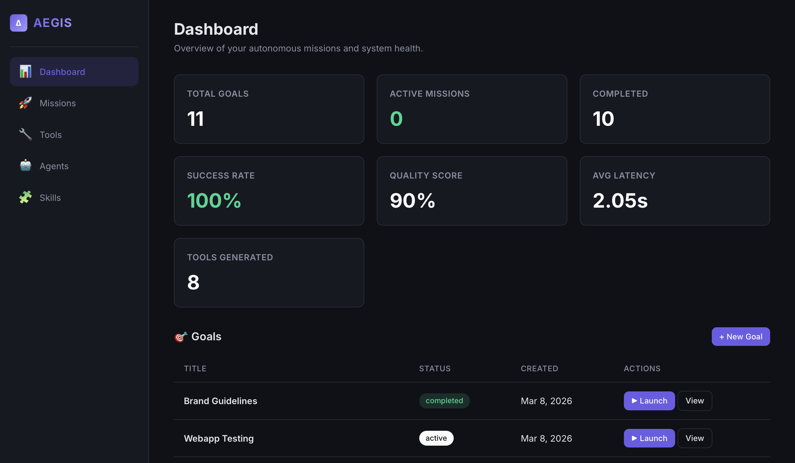

# AEGIS — Autonomous Execution & Governance Intelligent System

<div align="center">

  [](./LICENSE)
  
  
  
  
  
  *A production-grade agentic AI platform for autonomous task execution, hierarchical planning, and self-improving workflows.*
</div>

```
Browser  →  Oat UI Frontend  →  FastAPI Backend  →  Supabase DB  →  LLM APIs
```

[](https://youtu.be/KXqjEhTy-uE)

## Features

- **Agentic Orchestration:** Multi-agent pipeline via LangGraph (Planner, Executor, Critic, Monitor, Toolsmith, etc.)
- **First-Class Anthropic Skills:** Natively browse, import, and install [Anthropic Agent Skills](https://github.com/anthropics/anthropic-quickstarts/tree/main/computer-use-demo/skills) directly from their GitHub.
- **Auto-Tool Generation:** Automatically converts instructional markdown (`SKILL.md`) into executable Python tools using the Toolsmith agent, with fallback to standard-library-only code generation if blocked imports are detected.
- **Skill-Aware Planning:** Goals created from skills automatically pass the context to the Planner, ensuring that the pre-installed tools are heavily utilized in the execution plan.
- **Sandboxed Execution:** Tools are executed securely inside a local subprocess or E2B cloud sandbox.
- **Live Telemetry & UI:** Clean Oat UI frontend to track active goals, live mission logs, auto-polling telemetry, and self-improvement metrics.

## Architecture

AEGIS is built around a multi-agent orchestration system powered by LangGraph. Each agent has a specific role in the autonomous pipeline:

```
┌─────────────────────────────────────────────────────────┐
│                     AEGIS Platform                       │
├──────────┬──────────────────────────────────────────────┤
│          │                                              │
│  Goals   │   GoalManager → Planner → Decomposer        │
│          │       ↓                                      │
│  Plan    │   Toolsmith (optional) → Executor            │
│          │       ↓                                      │
│  Execute │   Critic → Verifier → Memory                 │
│          │       ↓                                      │
│  Learn   │   Monitor → Scheduler → Self-Improve         │
│          │                                              │
├──────────┼──────────────────────────────────────────────┤
│  Data    │   Supabase (PostgreSQL + pgvector)           │
│  LLM     │   Groq API (via LangChain)                  │
│  Sandbox │   E2B / subprocess                           │
└──────────┴──────────────────────────────────────────────┘
```

## Agents

| Agent | Role |
|-------|------|
| **GoalManager** | Stores goals, schedules executions, maintains goal state |
| **Planner** | Decomposes goals into structured execution plans |
| **Decomposer** | Refines unclear or complex tasks into actionable steps |
| **Toolsmith** | Dynamically generates Python tools and registers them |
| **Executor** | Executes tasks, runs tools in a sandboxed environment |
| **Critic** | Analyzes outputs, detects problems, suggests improvements |
| **Verifier** | Validates correctness of execution results |
| **Memory** | Stores embeddings in pgvector for long-term recall |
| **Monitor** | Tracks success rate, latency, cost metrics |
| **Scheduler** | Manages retries, prioritization, and mission scheduling |

## Tech Stack

**Backend:** Python 3.11+ · FastAPI · LangChain · LangGraph · Groq API  
**Frontend:** Oat UI · Vanilla JavaScript · Semantic HTML  
**Database:** Supabase PostgreSQL + pgvector  
**Sandbox:** E2B cloud sandbox / subprocess fallback  

## Quick Start

### Prerequisites

- Python 3.11+
- A [Supabase](https://supabase.com) project with pgvector enabled
- [Groq API key](https://console.groq.com)
- (Optional) [E2B API key](https://e2b.dev) for cloud sandboxing

### 1. Clone & configure

```bash
git clone https://github.com/your-username/AEGIS.git
cd AEGIS
cp .env.example .env
# Edit .env with your API keys
```

### 2. Set up the database

Run the following SQL files in your Supabase SQL Editor (or via Supabase CLI) in this exact order to set up the tables and vector extensions:

1. `supabase/schema.sql` (Creates core tables: goals, plans, tasks, tools, metrics, memory)
2. `supabase/skills_migration.sql` (Adds the skills table for Anthropic integrations)

### 3. Start the backend

```bash
cd backend
python -m venv .venv
source .venv/bin/activate
pip install -r requirements.txt
uvicorn app.main:app --reload --port 8000
```

### 4. Open the frontend

Open `frontend/templates/dashboard.html` in your browser. The frontend connects to the API at `http://localhost:8000`.

## API Endpoints

| Method | Path | Description |
|--------|------|-------------|
| `POST` | `/api/goals` | Create a new goal |
| `GET` | `/api/goals` | List all goals |
| `POST` | `/api/goals/{id}/launch` | Launch a mission for a goal |
| `GET` | `/api/missions/{goal_id}/status` | Get real-time mission status, plans, tasks, and logs |
| `GET` | `/api/plans/{goal_id}` | Get plans for a goal |
| `GET` | `/api/tasks/{task_id}` | Get task details |
| `POST` | `/api/tools` | Register a tool |
| `GET` | `/api/metrics` | Get telemetry data |
| `GET` | `/api/skills` | List available Anthropic skills |
| `POST` | `/api/skills/sync` | Sync skills from Anthropic repository |
| `POST` | `/api/skills/{id}/install` | Convert a skill into an executable tool |
| `WS` | `/ws/logs/{task_id}` | Stream live logs |

## Example Mission

**Goal:** "Track GPU prices weekly"

1. **GoalManager** stores the goal and schedules weekly execution
2. **Planner** creates a plan: scrape GPU prices → store data → generate report
3. **Toolsmith** generates `gpu_price_tool.py` dynamically
4. **Executor** runs the tool in a sandbox
5. **Critic** analyzes the price data for anomalies
6. **Verifier** validates the data format and completeness
7. **Monitor** records execution metrics (cost, latency, success)

## Creating Custom Tools

Tools follow a simple interface:

```python
def run(input: dict) -> dict:
    """Tool description here."""
    # Your logic
    return {"result": "data"}
```

Register via the API or let the Toolsmith agent generate them automatically.

## Project Structure

```
AEGIS/
├── backend/
│   └── app/
│       ├── agents/          # All agent implementations
│       ├── api/             # FastAPI route handlers
│       ├── models/          # Pydantic schemas
│       ├── orchestrator/    # LangGraph workflow
│       ├── sandbox/         # Code execution sandbox
│       ├── skills/          # Anthropic skills sync, parser, generator, and trust scoring
│       ├── config.py        # Environment configuration
│       ├── database.py      # Supabase client
│       ├── llm.py           # LLM provider setup
│       └── main.py          # FastAPI application
├── frontend/
│   ├── templates/           # HTML pages
│   └── static/              # JS and CSS
├── supabase/
│   ├── schema.sql           # Database core schema
│   └── skills_migration.sql # Anthropic skills schema
├── .env.example
└── README.md
```

## License

This project is licensed under the [MIT License](./LICENSE).
